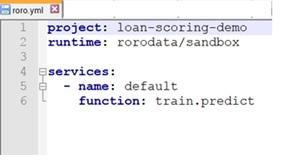

## About rorodata
### What is rorodata?
rorodata is a cloud based platform to help data scientists build, deploy, and manage end-to-end Machine Learning (ML) applications in production, using a simple, repeatable, flexible, and automated process. 
rorodata works with a simple set of commands. It creates a repeatable process to fully automate cloud-infrastructure setup, provisioning data science environments including custom packages, and has the flexibility to specify on-demand computing resources for each task or service.  
In short, it eliminates all the ad-hoc, error-prone, repetitive tasks that go into productionizing machine learning applications

Currently, rorodata enables data scientists to do four things:
1.	Build models in the cloud using Jupyter notebooks
2.	Train ML models on ad-hoc basis as well as on a time-schedule (periodic retraining )
3.	Deploy ML models into production and expose prediction APIs as web-services
4.	Track multiple versions of ML models and associated metadata

### How does rorodata work?
rorodata platform is organized by projects. A project is a machine learning application including its code, all associated tasks and services, persistent data volumes, and ML models. 
The software environment for the project, the services to run, and period tasks to be scheduled are specified in a simple text file named roro.yml 
When a project is deployed, rorodata takes its cue from this roro.yml file and goes through the following process
1.	 Packages and moves all code to the platform
2.	Automatically provisions the necessary software environments using a docker image
3.	Deploys each service into production, with the specified compute power for that service
4.	Set up URL endpoints for each service 
5.	Schedules periodic tasks
 

### Some Useful Technical Details
---

#### Project Directory Structure
The main working directory for a project is referenced as ‘/app’. This contains all the files packaged from the local code repository when you execute deploy from the roro client. These get overwritten after every execution of deploy

Volumes are persistent data storages and can be referenced as ‘/volumes’. By default, you will see two volumes, /data and /notebooks under /volumes. Unlike (the files in) /app, /volumes does not get overwritten - these volumes are persistent. Shortly, you will be able to mount your S3 buckets as rorodata volumes and access them directly as /volumes/your-s3-bucket 

By default, notebooks created in the project i.e using roro run:notebook get created in /volumes/notebooks

#### Command Line Interface (CLI)
rorodata CLI client offers a number of simple commands to manage and monitor activity on the rorodata platform. The most commonly used ones are roro login, roro create project, roro deploy, roro ps, roro logs <jobid>, etc. You can get a full list of these commands and their description by typing roro --help, and access details for a specific command (e.g. cmd1) by typing roro cmd1 --help

#### Understanding the roro.yml file
The roro.yml is a simple text file that tells rorodata platform what to do, during deployment. Here is a quick explanation of the contents of this example roro.yml file

 

* <b>project</b>: loan-scoring-demo  This tells rorodata platform that the rorodata project that the local code is being deployed to, is the project loan-scoring-demo (in the above example). Note that project names are unique across rorodata platform (not just by project). Make sure that you replace your project name here, to make sure you are deploying to the correct project.
* <b>runtime</b>: rorodata/sandbox  In this example, the docker image used to create the runtime environment for the python code has been given the short name rorodata/sandbox.  During deployment, this docker image is used to create a virtual environment for running code in this project. Note, any python libraries not part of this runtime can be included in the docker image, by specifying those libraries in a requirements.txt file.  Please refer to the rorodata documentation to check out the specifications for the different runtime docker images available.
* <b>services</b>: This lists all the services exposed by this project as endpoints.  In this case, there is one service that exposes the function predict.  In general, there can be multiple services in a project, each with its own name and a function attached to each name. 
	* <b>name:default </b> Any name can be chosen by the user; the endpoint URL gets formed as your-project-name-- servicename.rorocloud.io.  If name is left as default, then the endpoint URL will be formed as <projectname>.rorocloud.io. In this example, the endpoint will be https://<i></i>loan-score-demo.rorocloud.io    
	* <b>function: train.predict</b> This is the full path to the function being exposed e.g. because the predict function is in the file train.py (in this example), the entry made in the roro.yml file below name is function:train.predict
